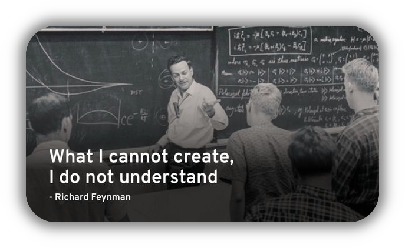

  

<!--START_SECTION:waka-->
<!--END_SECTION:waka-->

<h3 align="center">Programming Languages</h3>

  

<h3 align="center">Operating Systems</h3>

  

<h3 align="center">DevOps</h3>

  

<h3 align="center">Developer Tools</h3>

  

<h3 align="center">Social Profiles</h3>

  

<h3 align="center">What's next?</h3>

  

